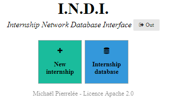
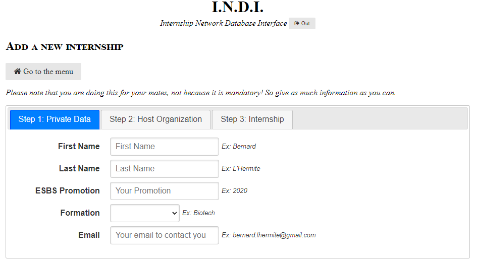
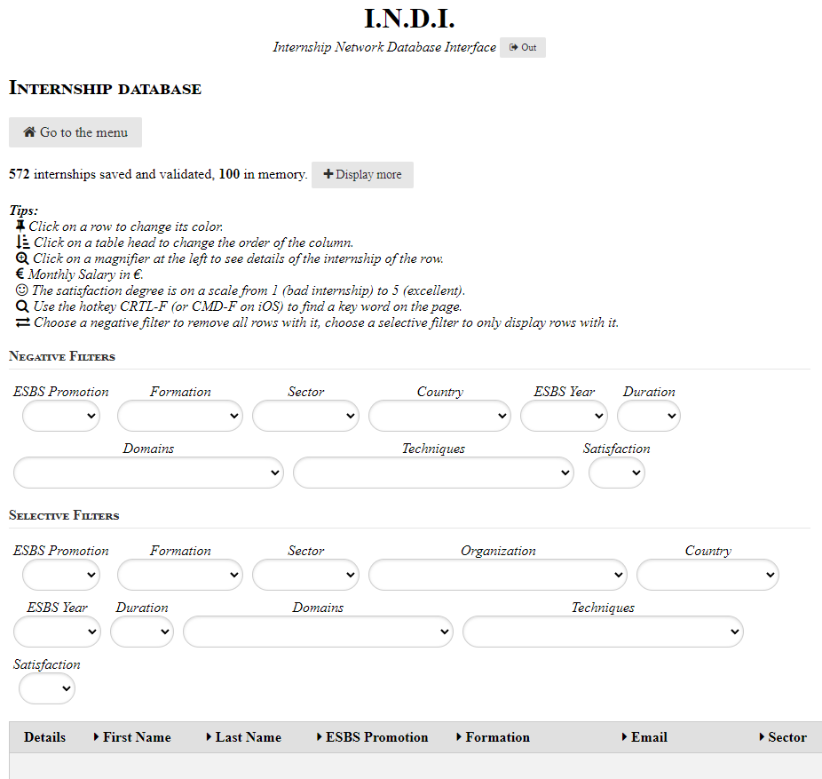
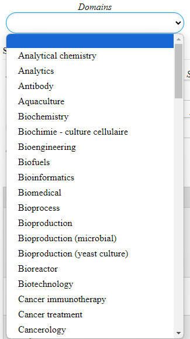
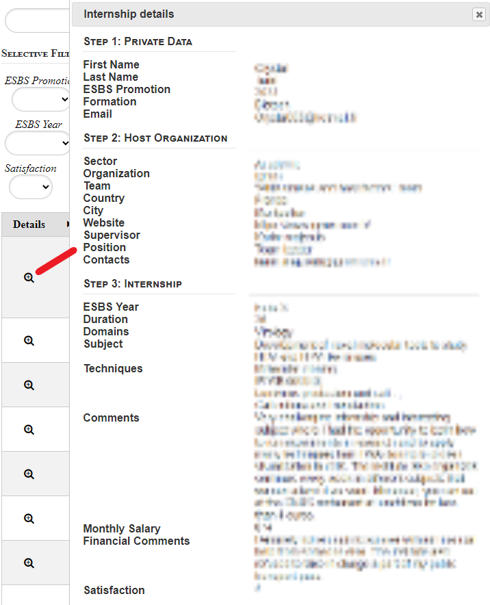
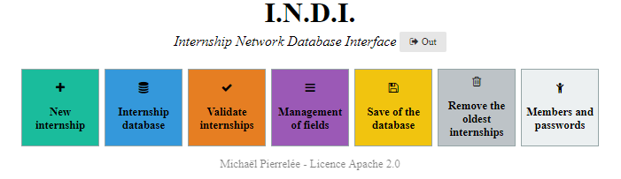

# Internship Network Database Interface (INDI)

**Michaël Pierrelée, 2016.**

## Description

Finding internships is difficult. It requires a strong network of possible companies and labs that can employ students. Former students should inform their newly arrived comrades widely and openly.

This app manages the internship networks of students. It enables to submit and access the internships' information so that future students can see what and where the internships have been done.

Users can select internships based on customizable filters that depend on the information fields and user input.

Administrators can customise the information fields submitted by users. They must also validate new entries before they are added to the database.

This is an asynchronous app coded in PHP and JavaScript. It has been employed by the [ESBS students](https://amicaleesbs.eu/indi) (European School of Biotechnology of Strasbourg) since 2016. In 2024, it has now more than 500 entries for ten years in its database. Any organization can reuse and adapt it freely, following the licence Apache 2.0 (see below).

## Gallery

* The user interface of the app:

* Submit an internship by the students:

* Access the internships in the database:

* Filter the internships:

* Access to the details of the internship entry:

* For the admins, other menus are available:

## Advice to the administrators

### Use of the app

- **Admin.** The administrator has access to everything, and must verify new internship entries.
- **Verification.** As soon as an internship is validated or rejected, the next one is displayed. A rejected internship is deleted. Admin edits to an internship cannot not saved without validating it.
- **Edit.** To modify a validated internship, go to the database interface, open the internship details and click on “send back to validation”. Then return to the “validate internship” page and proceed as above.
- **Field customization.** Do not make any changes without clear knowledge on the goal and the effects. Information fields (promotion, subject, etc.) can be added, removed or edited via the “management of fields” tool. HTML code of the other fields can help. All changes are final, so make a backup first (see below). 
- **Backups.** The database (stages and fields) can be saved with the menu "save of the database”. This should be done every year. Files are stored internally. To retrieve them, source files are accessible via FTP at www/indi/backups/save. The backup is divided into two files: one for the internships table and one for the fields table.
- **Database cleaning.** The oldest internships can be removed based on the promotion (year). Having a large database induces a burden of information and a high latency for the users.
- **Access.** The menu “members and passwords” defines user access. The app should have at least one user (level 1), that only accesses to the submission and database, and one admin (level 2). The last admin cannot be deleted.

### Verify the entries

- Keep the database clean: proofread the entries and correct for the mistakes.
- Do not keep incomplete fields.
- Do not confuse domains and techniques. Cell biology is a domain, microscopy is a technique.
- Keep short the subjects and the "how" fields.

## Install

### Requirements

PHP7.4 and MySQL/MariaDB (mysqli driver).

The app works on classic web servers from providers such as OVH. One can test the app by setuping a local server with Debian or WampServer for Windows. See [this tutorial to install a server on Debian (eg OS, VM or WSL)](tutorial_debian_webserver.md)

### Procedure

1. Prepare the database by creating the tables `interns_fields`, `interns_internships` and `interns_members.sql`. To do so, use the `.sql` commands in `database_config`.
2. Upload `src/` onto the server and configure the paths to access this folder from an url. 
3. Update `src/functions.php` to adapt the line `new PDO('mysql:host=XXXXX.mysql.db;dbname=XXXXXX;charset=utf8', 'login', 'password')` according to the database access.
4. Update the files `src/backups/save/.htpasswd` and `src/backups/save/.htaccess` (such as the database backups won't be accessible). To that by crypting an admin password using `src/backups/crypt.php`, then copy it into the `.htpasswd` file.
5. If existing entries have to be imported into the database, follow `import_entries/readme.md`.

### Pre-made users

* If the file `interns_members.sql` was used to generate the table, then two users are available: `admin` (with admin rights) and `user` (with access to the internships only), with the password `1234`.
* These users can be replaced in the admin panel of the app.
* Otherwise, they can be manually added into the database. To do so, use the file `src/backups/crypt.php`. After filling the password field, the second hashed value can be inserted into the table `interns_members`. Level `1` corresponds to an user and `2` to an admin.

## Licence

[Licence Apache 2.0](LICENSE.md)
- **Permissions:** Commercial use, Distribution, Modification, Patent use, Private use
- **Conditions:** License and copyright notice, State changes
- **Limitations:** Trademark use, Liability, Warranty